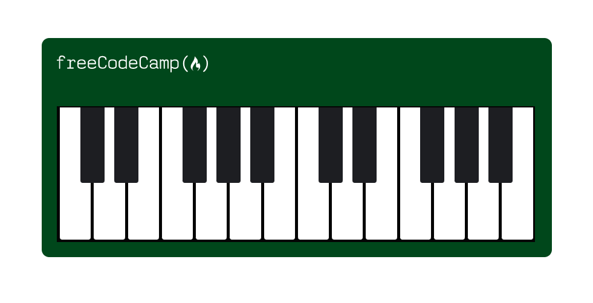

# FreeCodeCamp Piano

Piano made on FreeCodeCamp to learn more about responsive web design

## Preview

In this course I better understood these concepts:

- `content` property is used to set or override the `content` of the element. Setting the `content` property to an empty string `“”` will ensure the element is rendered to the page while still being empty;

- `@media` (media query), is used to apply some conditionally CSS code. Media queries are used to apply CSS based on the viewport width, using `max-width` and `min-width`;

## Conclusion

Finally I'm starting to build responsive pages on FreeCodeCamp, I've already coded some responsive desings on my GitHub so I'm familiar with the concept of media querys.

My current goal is to master React, but first I need to complete some begginer courses on FreeCodeCamp.